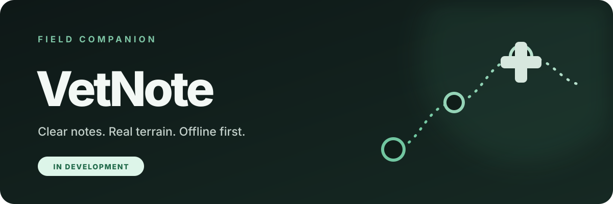

  

  <a href="README.md">Version française</a>  
  <code>IN DEVELOPMENT</code>&nbsp; <code>MOBILE</code>

  <strong>An application designed to make planning and note-taking easier 
  during veterinary field visits.</strong>

---

| Offline first | Fast in the field | Data under control |
| :---: | :---: | :---: |
| An experience designed to remain useful without a network. | A readable interface that removes unnecessary steps. | Professionals remain in control of their notes. |

## Why the field changes everything

Network access is not always available in the field, and every unnecessary step slows the work down. Information collected during a visit must remain easy to enter, retrieve and protect.

VetNote explores an experience designed around these real-world constraints instead of simply moving a desktop tool onto a phone.

## Project principles

- Work offline first.
- Remain readable and quick to use in real conditions.
- Reduce duplicate data entry after a visit.
- Structure information without making the veterinarian’s work heavier.
- Protect data stored on the device.
- Keep the professional in control of the content of their notes.

## A deliberately focused vision

VetNote focuses on the experience during and around a field visit. The project evolves from the profession’s real constraints, with particular attention paid to clarity and reliability.

---

### Status

VetNote is currently **in development**. The project is still evolving and no public release date has been announced.

### Project confidentiality

This page only presents the general vision behind VetNote. The source code, architecture, roadmap and domain-specific details remain private.

  <a href="mailto:koveo.agency@gmail.com"><strong>koveo.agency@gmail.com</strong></a>

